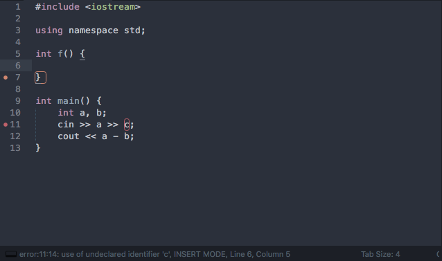
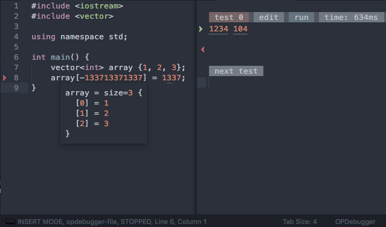

Fast Olympic Coding plugin for Sublime Text 3
================
 * [Installation](#installation)
 * [TestManager](#testmanager)
 * [Settings](#settings)
 * [Class Completion](#classcompletion)
 * [CppLint](#cpplint)
 * [Debugger](#debugger)
 
### Installation
 * Install via [Package Control](https://packagecontrol.io/packages/CppFastOlympicCoding)
 * Install manually: 
       [download plugin](https://github.com/Jatana/FastOlympicCoding/archive/master.zip) into packages (`preferences — browse packages`) 
       `Warning! rename plugin folder to FastOlympicCoding`

### TestManager
 
#### TestManager Keybindings
 * <kbd>ctrl+b (OSX)</kbd> <kbd>ctrl+alt+b (Linux + Win)</kbd> compile and run
 * <kbd>ctrl+enter</kbd> new test
 * <kbd>ctrl+c (OSX)</kbd>  <kbd>ctrl+x (Linux + Win)</kbd> kill process
 * <kbd>ctrl+shift+b (OSX)</kbd> run with debugger
 * <kbd>ctrl+d</kbd> delete test
 * <kbd>cmd+k, cmd+p (OSX)</kbd> <kbd>ctrl+k, ctrl+p (Linux + Win)</kbd> close/open right panel

### Settings
 * to edit settings
   * press <kbd>cmd+shift+p (OSX)</kbd> <kbd>ctrl+shift+p (Linux + Win)</kbd> and type `Open Settings`
   * or `tools — FastOlympicCoding — settings`

### Stress
 

### ClassCompletion
 

### CppLint
 
 
 * to edit lint open Settings
 
### Debugger
 

 * debugger only for OSX
 * <kbd>ctrl+shift+b</kbd> to run with debugger
 * hover cursor on variable to see its value

Theme in screenshots - [Theme - Spacegray](https://packagecontrol.io/packages/Theme%20-%20Spacegray)
